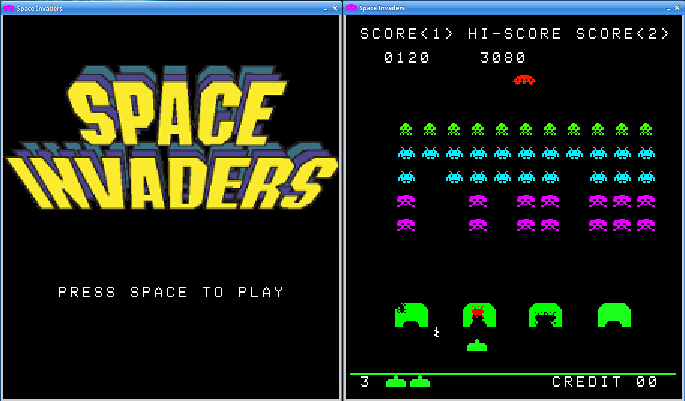

# Space Invaders
[Space Invaders](https://en.wikipedia.org/wiki/Space_Invaders) made with python and pygame. Information found on [computerarcheology.com](https://www.computerarcheology.com/Arcade/SpaceInvaders/) was used to make the mechanics closely match the arcade version 



## Dependencies

- Python >= 3.7 
- Pygame >= 2.0.1 
- Numpy >= 1.20.3

Or download an [executable](#binary-files) packaged with [pyinstaller](https://pyinstaller.readthedocs.io/en/stable/) for your operating system

## Binary Files
Binary releases for 64 bit Ubuntu 16.0+ and Windows 7/10 - [https://github.com/sitaber/SpaceInvaders/releases](https://github.com/sitaber/SpaceInvaders/releases)

### For Ubuntu: 
1. Download the zip file and unzip
2. Make sure the file has permissions to run:
    - right-click on the file, select Properties > Permissions and check the box "Allow this file to run a program" 
3. Open a terminal in the directory on enter
  ```
  ./spaceinvader
  ```
### For Windows: 
1. Download
2. Unzip
3. Navigate to the root folder 
4. Double-click on the binary

# How to Play
Once you can run the game _(NOTE: the executable takes a bit to load)_ you will be presented with an intro screen.

- Press _SPACE_ to start play
- The _A_ keyboard key moves the player left
- The _D_ keyboard key moves the player right
- Use _SPACE_ bar to shoot
- Try for the high score!

# ENJOY!
